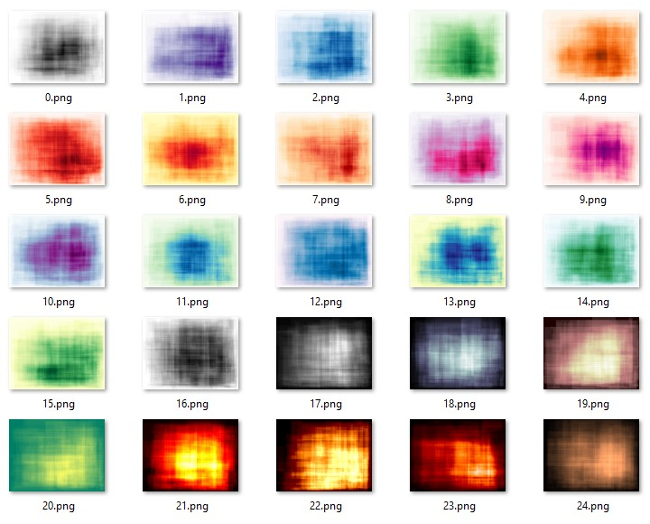
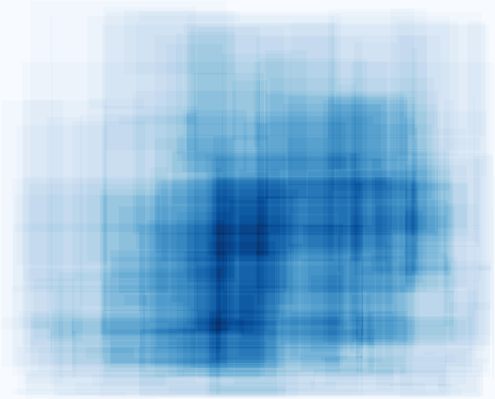
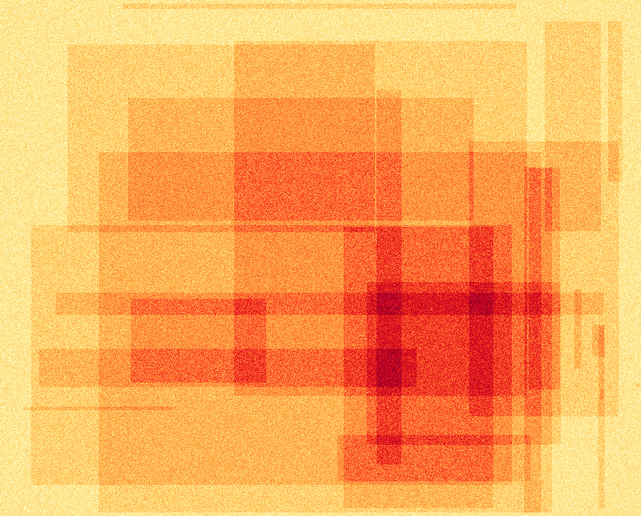

# random-cubic-images
Random cubic image generator.

### Usage as Python modul
```
# Generate image
img = images.get_image()

# Save it as a *.png file
with open("output.png", "wb") as f:
    f.write(img.getbuffer())
```

#### Optional parameters of get_image() function:

**size_x**: integer,
    Length of the image in pixels, default is 500

**size_y**: integer,
    Height of the image in pixels, default is 500

**style_code**: integer,
    Color style code to apply (valid codes: [0-24]).
    If the given value out of range or not provided, then a random style code will be used.

**noisy**: boolean,
    Produce a clean or noisy image, the default is False.

**iter**: integer,
    Number of iterations (the number of rectangles on result image), the default value is 200.

The function returns the generated PNG image as BytesIO object.

### Color style codes (from value 0 to 24):



### Usage as a REST API service
For testing simply run app.py file, that will launch Flask's development web server.

***Flask's development web server is not suitable for production environment!***

The application will listen on http://localhost:5055
```
python app.py
```

On Linux environment use gunicorn web server instead:
```
gunicorn -w 4 --bind 0.0.0.0:5055 'app:app'
```

Detailed api description available here (if the application runs on the default 5055 port):
http://localhost:5055/api/

#### Sample API calls

```
http://localhost:5055/api/get-clean-image?length=1024&height=768
http://localhost:5055/api/get-noisy-image?style=2
http://localhost:5055/api/get-noisy-image?iter=10
```

### Build Docker image and run the REST API service in a container
A prepared **Dockerfile** also provided. To build and run Docker images:

```
cd <path of Dockerfile>

docker build -t random-cubic-images .
docker run -d -p 5055:5055 --name cubic-images random-cubic-images
```

### Download from Docker Hub
You can also download the built image from Docker Hub:
```
docker pull bakostamas/random-cubic-images
```
Run in a container as described in previous step.

### Random generated example images
#### Example 1


#### Example2

